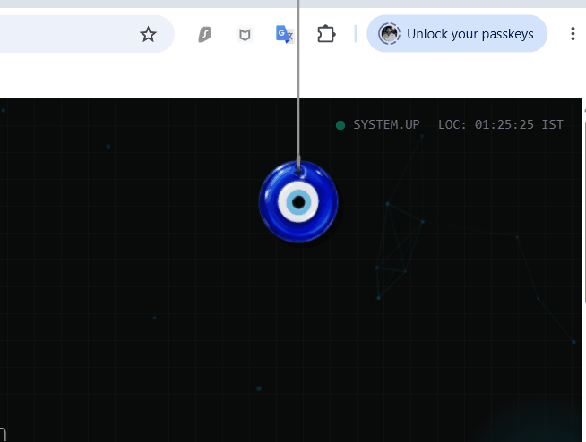

# 🧿 Lucky Dangle

A lightweight, interactive desktop widget built with Python and PyQt6. Lucky Dangle sits on your desktop, rendering a customizable, physics-driven charm that gracefully drops into place. It runs silently in your system tray and stays out of your way.



## ✨ Features
* **Custom Physics Engine:** Features realistic spring physics (Hooke's Law) for a natural, gravity-driven drop and bounce animation when loading charms.
* **System Tray Integration:** Completely hidden from the taskbar. Control the app entirely via a clean, right-click system tray menu.
* **Interactive:** Hover over the charm to gently push it, or click and drag to swing it around your screen.
* **Dynamic Audio:** Plays a subtle chime when specific charms (like the Bell) are selected.
* **Auto-Start (Windows):** Toggle "Run at Startup" directly from the menu, integrated seamlessly with the Windows Registry.

---

## 🚀 Quick Install (For Regular Users)

You do not need to install Python to run this app. 

1. Go to the [dist](../../dist) page on this repository.
2. Download `lucky_dangle.exe`.
3. Run the executable file inside. 
   > **Note:** Because this is an unsigned indie app, Windows SmartScreen may block it initially. Click "More Info" -> "Run Anyway".

---

## 💻 Developer Setup (Run from Source)

If you want to view the code, modify the physics, or add your own charms, you can run the app directly via Python.

### Prerequisites
* Python 3.10+
* `PyQt6`

### Installation Steps

1. **Clone the repository:**
   ```bash
   git clone [https://github.com/Shyleshpatil/Dangle.git](https://github.com/Shyleshpatil/Dangle.git)
   cd Dangle
   
### Install dependencies:
  ```bash
    pip install PyQt6
    
### Run the application:
  ```bash
    python lucky_dangle.py

🎨 Adding Custom Charms
Want to add your own images? Simply drop any .png file into the charms/ folder. The application will automatically read the folder on startup and add your new image to the right-click system tray menu.
   
